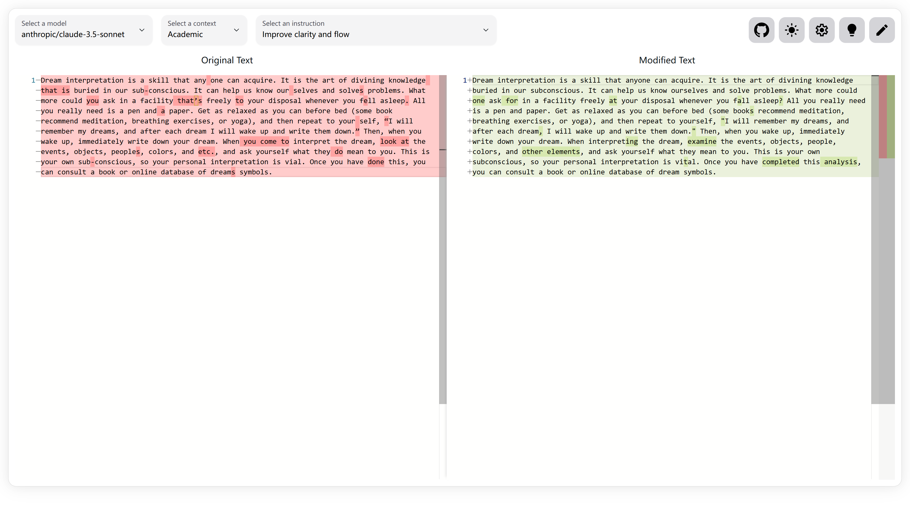

# Waner Proofreader

Waner Proofreader is an AI-powered tool designed to help non-native English speakers proofread their text smoothly.

> The tool is named after <del>the character Shangguan from the game Honor of Kings (王者荣耀里的上官婉儿)</del> the historical figure Shangguan Wan'er (上官婉儿), a renowned Chinese poet and politician.

Here is a [demo](https://waner.auroradysis.com). You need to configure your own API URL and key to use it.

# Screenshots



# Installation

To run Waner Proofreader locally, ensure that you have Node.js installed on your machine. Follow these steps to set up the project:

1. Clone the repository:

   ```bash
   git clone https://github.com/AuroraDysis/waner-proofreader.git
   ```

2. Navigate to the project directory:

   ```bash
   cd waner-proofreader
   ```

3. Install the required dependencies:

   ```bash
   npm install
   ```

4. Create a `.env` file in the root directory and add the following environment variables:

   ```
   API_KEY=<your_api_key>
   OPENAI_BASE_URL=https://openrouter.ai/api/v1
   OPENAI_API_KEY=<your_openrouter_api_key>
   NEXT_PUBLIC_OPENAI_MODEL=anthropic/claude-3.5-sonnet,anthropic/claude-3-opus,openai/chatgpt-4o-latest,openai/gpt-4
   ```

   Replace `<your_openrouter_api_key>` with your actual OpenRouter API key, which you can obtain by signing up at [OpenRouter](https://openrouter.ai/). If you want to use other providers, you may want to modify `NEXT_PUBLIC_OPENAI_MODEL` accordingly. Alternatively, you can set the model in the UI. Replace `<your_api_key>` with your API key for security. You can pass multiple keys separated by commas.

5. Start the development server:

   ```bash
   npm run dev
   ```

6. Open your web browser and visit `http://localhost:3000` to access Waner Proofreader.

# Credits

- Some parts of the code & prompts are inspired by [refiner](https://github.com/imankulov/refiner)
- Some prompts are inspired by [editGPT](https://editgpt.app/?via=zhen)
- Some prompts are inspired by [GenAI LaTeX Proofreader](https://github.com/genai-latex-proofreader/genai-latex-proofreader)

# Licenses

waner-proofreader is licensed under the MIT License. See [LICENSE](./LICENSE) for more information.
